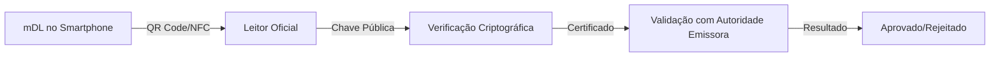

Em muitas partes dos Estados Unidos e em outras regiões do mundo, apresentar sua carteira de motorista pode agora ser tão simples quanto desbloquear seu telefone. Governos estão implementando IDs digitais e carteiras de motorista móveis (mDLs) que residem em seu smartphone, substituindo o tradicional cartão de plástico por uma credencial digital verificável com um toque ou escaneamento.

Como muitas novas tecnologias, os IDs digitais prometem conveniência e segurança aprimorada. No entanto, também levantam questões importantes de cibersegurança e privacidade que precisam ser compreendidas antes da adoção.

## O que é uma Carteira de Motorista Móvel?

Uma carteira de motorista móvel (mDL) vai além do cartão físico tradicional. Em vez de residir na sua carteira física, uma mDL fica armazenada no seu smartphone como uma credencial digital emitida pelo órgão responsável (como o DETRAN no Brasil ou DMV nos EUA).

### Características Principais

**Armazenamento Seguro:**
- Armazenada em aplicativos seguros ou carteiras móveis (Apple Wallet, Google Wallet)
- Protegida por criptografia de hardware (Secure Enclave, Trusted Execution Environment)
- Requer autenticação biométrica ou PIN para acesso

**Divulgação Seletiva:**
Ao contrário de um cartão físico que expõe todas as informações de uma vez, uma mDL permite "divulgação seletiva". Por exemplo:
- Provar que é maior de 21 anos sem revelar nome completo ou endereço
- Compartilhar apenas a foto e data de nascimento para verificação de idade
- Exibir apenas o número da CNH sem outros dados pessoais

**Status de Implementação:**
Atualmente, as mDLs estão em fase de desenvolvimento e testes piloto em muitos locais, podendo não estar amplamente disponíveis em todas as regiões ainda.

## Benefícios de Cibersegurança das mDLs

Os IDs digitais oferecem vantagens significativas de segurança em comparação com cartões físicos tradicionais:

### Proteção Contra Falsificação

**Criptografia Avançada:**
```javascript
// Exemplo conceitual de verificação criptográfica
const verifyDigitalID = async (mDLData, publicKey) => {
  // Assinatura digital verificada usando criptografia assimétrica
  const signature = mDLData.signature;
  const payload = mDLData.payload;
  
  // Verificação usando chave pública do emissor
  const isValid = await crypto.subtle.verify(
    "ECDSA",
    publicKey,
    signature,
    payload
  );
  
  return isValid;
};
```

**Características Anti-Falsificação:**
- Assinaturas digitais criptográficas impossíveis de replicar sem a chave privada do emissor
- Certificados digitais vinculados à autoridade emissora
- Timestamps e nonces que previnem replay attacks

### Detecção de Adulteração

Aplicativos de mDL podem detectar se um ID foi:
- Alterado após emissão
- Copiado ou duplicado
- Revogado pelo emissor
- Comprometido por malware

### Redução de Exposição de Dados

**Princípio de Menor Exposição:**
- Compartilhe apenas informações necessárias para cada transação
- Evite exposição desnecessária de dados pessoais completos
- Controle granular sobre quais dados são compartilhados

**Exemplo Prático:**
```yaml
Cenário: Verificação de idade em bar
Cartão Físico: Expõe nome completo, endereço, número da CNH, foto
mDL: Expõe apenas foto + "Maior de 21 anos" (verificado criptograficamente)

Benefício: Reduz superfície de ataque e minimiza coleta de dados
```

### Gerenciamento Remoto

Se seu telefone for perdido ou roubado:
- Revogação imediata do ID digital via aplicativo ou portal web
- Bloqueio remoto da credencial
- Emissão de nova credencial sem necessidade de ir ao órgão emissor

**Comparação:**
- **Cartão Físico Perdido:** Requer visita ao órgão, pagamento de taxa, espera de dias/semanas
- **mDL Comprometida:** Revogação instantânea, nova emissão em minutos

## Riscos e Vulnerabilidades

Como qualquer tecnologia que armazena dados sensíveis, mDLs apresentam riscos específicos que precisam ser mitigados:

### Comprometimento do Dispositivo

**Ameaças:**
- Malware que captura dados do ID digital
- Rootkits que interceptam autenticação biométrica
- Jailbreak/root que compromete o Secure Enclave
- Ataques de engenharia social para obter PIN/biometria

**Mitigação:**
```bash
# Verificar integridade do dispositivo (Android)
adb shell getprop ro.build.tags
# Deve retornar "release-keys" (não "test-keys" ou "dev-keys")

# Verificar se dispositivo está comprometido
# - SafetyNet/Play Integrity (Android)
# - DeviceCheck (iOS)
```

### Aplicativos Falsos

**Técnicas de Phishing:**
- Aplicativos falsos que imitam o app oficial
- SMS/Email com links para download de app malicioso
- Propaganda em redes sociais direcionando para apps falsos

**Sinais de Alerta:**
- App não disponível na App Store/Play Store oficial
- Solicitação de permissões excessivas
- Pedido de senha/PIN fora do contexto normal
- Solicitação de captura de tela do ID digital

### Questões de Privacidade

**Riscos de Rastreamento:**
- Empresas coletando dados além do necessário
- Governos usando mDLs para vigilância
- Correlação de dados entre diferentes transações
- Criação de perfis comportamentais

**Proteções Necessárias:**
- Leis de proteção de dados (LGPD, GDPR)
- Transparência sobre coleta e uso de dados
- Direito ao esquecimento
- Auditoria de acessos

### Padrões Inconsistentes

**Desafios:**
- Implementações diferentes entre estados/países
- Falta de interoperabilidade entre sistemas
- Níveis de segurança variados
- Regulamentações desencontradas

**Impacto:**
- Dificuldade de uso em viagens interestaduais/internacionais
- Necessidade de manter cartão físico como backup
- Confusão sobre direitos e proteções

## Como se Manter Seguro com ID Digital

Se seu estado/país oferece carteira de motorista digital e você deseja adotá-la, siga estas práticas recomendadas:

### 1. Use Apenas Aplicativos Oficiais

**Fontes Confiáveis:**
- Site oficial do órgão emissor (DETRAN, DMV, etc.)
- Apple App Store (para iOS)
- Google Play Store (para Android)
- Carteiras nativas: Apple Wallet, Google Wallet

**Verificação:**
```bash
# Verificar assinatura do aplicativo (Android)
apksigner verify --print-certs app.apk

# Verificar desenvolvedor na App Store (iOS)
# Verificar "Desenvolvedor" na página do app
```

**Nunca:**
- Baixe apps de links em emails ou SMS
- Instale apps de fontes não verificadas
- Use apps de terceiros para gerenciar seu ID digital

### 2. Proteja seu Dispositivo

**Autenticação Forte:**
- Senha/PIN forte (mínimo 6 dígitos, preferencialmente alfanumérica)
- Biometria habilitada (impressão digital, reconhecimento facial)
- Autenticação multifator para apps críticos

**Configuração de Segurança:**
```yaml
Android:
  - Habilitar bloqueio de tela
  - Configurar Smart Lock (opcional, com cautela)
  - Habilitar "Find My Device"
  - Desabilitar instalação de fontes desconhecidas
  - Habilitar verificação de apps (Play Protect)

iOS:
  - Habilitar Face ID/Touch ID
  - Configurar "Find My iPhone"
  - Habilitar "Erase Data" após 10 tentativas
  - Desabilitar Siri na tela de bloqueio (opcional)
```

### 3. Mantenha Software Atualizado

**Atualizações Críticas:**
- Sistema operacional (Android/iOS)
- Aplicativo de mDL
- Carteira móvel (Apple Wallet/Google Wallet)
- Navegador e outros apps de segurança

**Automatização:**
```bash
# Verificar atualizações pendentes (Android via ADB)
adb shell dumpsys package com.android.vending | grep versionCode

# iOS: Configurar atualizações automáticas
# Settings > General > Software Update > Automatic Updates
```

**Por que é Importante:**
- Correções de vulnerabilidades de segurança
- Melhorias em proteções criptográficas
- Patches para exploits conhecidos

### 4. Conheça seus Direitos

**Divulgação Seletiva:**
- Você não precisa sempre compartilhar o ID completo
- Use divulgação seletiva sempre que possível
- Questione solicitações de dados excessivos

**Exemplos de Uso:**
- **Bar/Restaurante:** Apenas verificação de idade
- **Banco:** Foto + nome completo (sem endereço completo)
- **Aluguel de carro:** Foto + número da CNH + validade

**Quando Recusar:**
- Solicitação de captura de tela do ID digital
- Compartilhamento via WhatsApp/Email não criptografado
- Apps de terceiros solicitando acesso ao ID digital

### 5. Mantenha-se Cético

**Sinais de Golpe:**
- Solicitação de captura de tela do ID digital
- Pedido de envio do ID por email/SMS
- Links suspeitos para "atualizar" ou "verificar" seu ID
- Pressão para compartilhar dados imediatamente

**Ações:**
- Bloqueie e denuncie tentativas de golpe
- Verifique a identidade de quem solicita dados
- Use canais oficiais para comunicação
- Reporte incidentes ao órgão emissor

## Arquitetura de Segurança de mDLs

### Componentes Técnicos

**Secure Element (SE):**
```yaml
Hardware:
  - Chip dedicado isolado do sistema principal
  - Resistente a ataques físicos e de software
  - Armazena chaves criptográficas privadas
  
Exemplos:
  - Secure Enclave (Apple)
  - Trusted Execution Environment (Android)
  - eSIM com Secure Element integrado
```

**Criptografia:**
- Chaves assimétricas (RSA-2048, ECC P-256)
- Assinaturas digitais (ECDSA)
- Certificados X.509
- Cadeia de confiança PKI

**Protocolos:**
- ISO/IEC 18013-5 (padrão internacional para mDLs)
- BLE (Bluetooth Low Energy) para comunicação
- QR codes criptograficamente assinados
- NFC para transmissão segura

### Verificação de Autenticidade

**Processo de Verificação:**


**Implementação:**
1. Leitor escaneia QR code ou recebe dados via NFC
2. Extrai assinatura digital e payload
3. Verifica assinatura usando chave pública do emissor
4. Valida certificado contra lista de revogação (CRL/OCSP)
5. Verifica timestamp e nonce para prevenir replay
6. Retorna resultado da verificação

## Casos de Uso e Cenários

### Verificação de Idade

**Cenário:** Entrada em estabelecimento que vende álcool

**Fluxo:**
1. Solicitante abre app de verificação
2. Usuário apresenta mDL via QR code
3. App verifica apenas: "Maior de 21 anos" (sim/não)
4. Não expõe nome, endereço ou outros dados

**Benefício:** Privacidade preservada, verificação rápida

### Aluguel de Veículo

**Cenário:** Aluguel de carro em locadora

**Fluxo:**
1. Usuário compartilha: Foto + Número CNH + Validade
2. Locadora verifica autenticidade via sistema oficial
3. Dados são armazenados apenas pelo tempo necessário
4. Usuário pode revogar acesso após devolução

**Benefício:** Menos exposição de dados, controle do usuário

### Check-in em Hotel

**Cenário:** Check-in em hotel

**Fluxo:**
1. Hotel solicita verificação de identidade
2. Usuário compartilha apenas dados necessários
3. Verificação criptográfica garante autenticidade
4. Dados podem ser deletados após check-out

**Benefício:** Processo mais rápido, menos risco de vazamento

## Implementação no Brasil

### Status Atual

**CNH Digital:**
- Já disponível em alguns estados brasileiros
- Integrada ao app "CNH Digital" oficial
- Aceita em alguns estabelecimentos
- Cartão físico ainda necessário como backup

**Desafios:**
- Aceitação ainda limitada
- Falta de padronização entre estados
- Necessidade de melhorias em segurança
- Educação do público sobre uso seguro

### Roadmap Futuro

**Tendências:**
- Expansão da aceitação em mais estabelecimentos
- Integração com outros documentos (RG Digital)
- Melhorias em segurança e privacidade
- Padronização nacional

## Checklist de Segurança

### Antes de Adotar mDL

- [ ] Verificar se está disponível na sua região
- [ ] Pesquisar sobre segurança da implementação
- [ ] Entender seus direitos e proteções legais
- [ ] Verificar compatibilidade do dispositivo
- [ ] Fazer backup do cartão físico

### Configuração Inicial

- [ ] Baixar app apenas de fonte oficial
- [ ] Verificar assinatura e desenvolvedor do app
- [ ] Configurar autenticação forte (biometria + PIN)
- [ ] Habilitar todas as proteções de segurança
- [ ] Testar funcionalidade de revogação

### Uso Diário

- [ ] Manter dispositivo atualizado
- [ ] Usar divulgação seletiva sempre que possível
- [ ] Verificar identidade de quem solicita dados
- [ ] Nunca compartilhar capturas de tela
- [ ] Monitorar acessos e transações

### Em Caso de Perda/Roubo

- [ ] Revogar mDL imediatamente via app/portal
- [ ] Bloquear dispositivo remotamente
- [ ] Reportar ao órgão emissor
- [ ] Monitorar uso fraudulento
- [ ] Solicitar nova credencial

## Conclusão

IDs digitais e carteiras de motorista móveis representam o futuro da identificação pessoal, oferecendo conveniência e segurança aprimorada quando implementadas corretamente. No entanto, como qualquer tecnologia emergente, apresentam novos riscos que precisam ser compreendidos e mitigados.

**Princípios Fundamentais:**

1. **Segurança em Camadas:** Combine autenticação forte, software atualizado e práticas seguras
2. **Privacidade por Design:** Use divulgação seletiva sempre que possível
3. **Ceticismo Saudável:** Desconfie de solicitações suspeitas e verifique fontes
4. **Educação Contínua:** Mantenha-se informado sobre novas ameaças e proteções
5. **Preparação:** Tenha um plano para perda/roubo do dispositivo

À medida que a adoção de mDLs cresce, é essencial que usuários, desenvolvedores e formuladores de políticas trabalhem juntos para garantir que essa tecnologia seja segura, privada e benéfica para todos.

**Um ID digital pode se tornar sua credencial mais importante - trate-o com o cuidado que merece.** 🛡️📱

---

**Referências e Recursos:**

- [ISO/IEC 18013-5 - Padrão Internacional para mDLs](https://www.iso.org/standard/73580.html)
- [NIST Digital Identity Guidelines](https://pages.nist.gov/800-63-3/)
- [OWASP Mobile Security](https://owasp.org/www-project-mobile-security/)
- Documentação oficial do seu órgão emissor local
