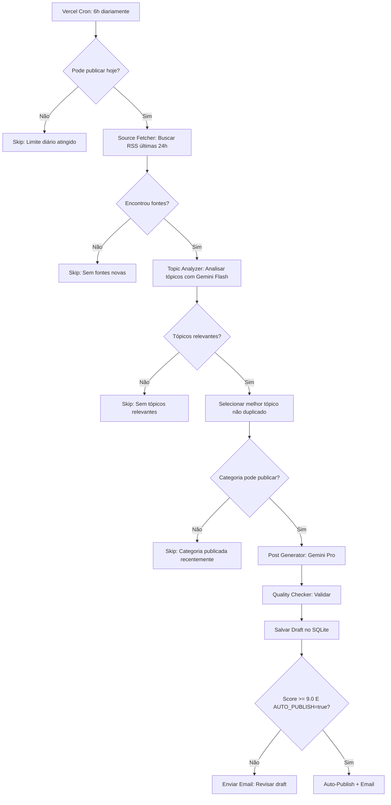
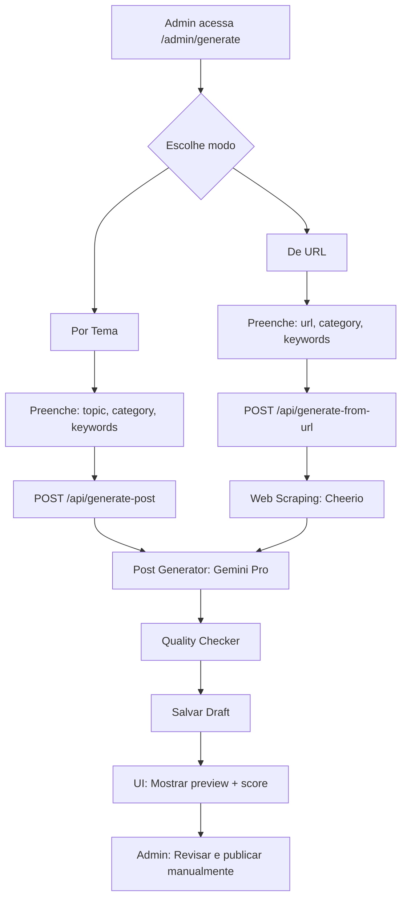

> [!CAUTION]
> **DOCUMENTO HISTÓRICO — NÃO REFLETE A ARQUITETURA ATUAL**
>
> Esta avaliação foi realizada sobre a versão **Next.js 15 + SQLite** do blog,
> que foi completamente substituída pela stack **Astro 5 + Content Collections
> (markdown)** em janeiro de 2026. Os componentes descritos abaixo (SQLite,
> Vercel Cron, auto-publish, API routes, painel admin React) **não existem mais**
> no sistema atual. Mantido apenas como referência histórica.

# Avaliação dos Processos de Geração de Conteúdo

**Data**: 26 de dezembro de 2025
**Analista**: Claude (Sonnet 4.5)
**Sistema**: Blog Ricardo Esper - Geração de Posts com IA

---

## 📊 Resumo Executivo

O sistema possui **dois processos distintos** de geração de conteúdo:

1. **Geração Automática** (Cron Job): Sistema autônomo que monitora fontes RSS, seleciona tópicos e gera posts sem intervenção humana
2. **Geração Demandada** (Painel Admin): Interface manual para criação sob demanda por tema ou URL

**Nota Geral do Sistema**: **8.7/10**

**Veredicto**: Sistema robusto e bem projetado, com excelente engenharia de prompts e arquitetura sólida. Requer ajustes em automação (migração SQLite) e aprovação humana para atingir nível enterprise.

---

## 🤖 Processo 1: Geração Automática (Cron Job)

### Fluxo de Trabalho



### Componentes Analisados

#### 1. **Source Fetcher** (9.0/10)

**Fontes RSS configuradas**:
- CISA Alerts (prioridade 10)
- Krebs on Security (prioridade 9)
- OWASP Blog (prioridade 9)
- Dark Reading (prioridade 8)

**Pontos fortes**:
- ✅ Fontes confiáveis e relevantes para cibersegurança
- ✅ Sistema de prioridades bem definido
- ✅ Filtro temporal (últimas 24h configurável)
- ✅ Error handling robusto por fonte
- ✅ Parsing eficiente com rss-parser

**Pontos fracos**:
- ❌ Limitado a apenas 4 fontes (poderia ter mais)
- ❌ Ausência de fontes brasileiras (CERT.br, ANPD)
- ❌ Sem fontes para outras categorias (travel, homeautomation, vida)
- ⚠️ Web scraping manual para ANPD (código comentado/não usado)

**Recomendações**:
1. Adicionar CERT.br Brasil, ANPD, BleepingComputer
2. Criar fontes RSS para outras categorias (Home Assistant, Nomad List)
3. Implementar web scraping como fallback
4. Sistema de cache para evitar refetch

---

#### 2. **Topic Analyzer** (8.5/10)

**Modelo**: Google Gemini 2.5 Flash (rápido e barato)

**Prompt**: Extremamente bem estruturado
```
Analisa fontes RSS → Sugere 3-5 tópicos → Retorna JSON:
{
  topic: string,
  category: string,
  keywords: string[],
  relevance: number,
  sources: string[],
  reasoning: string
}
```

**Pontos fortes**:
- ✅ Prompt engineering sofisticado
- ✅ Critérios claros de relevância
- ✅ Evita clickbait e sensacionalismo
- ✅ JSON estruturado e parseável
- ✅ Usa modelo Flash (rápido, ~0.3s)

**Pontos fracos**:
- ❌ Não verifica duplicação no próprio analyzer
- ❌ Sem análise de sentimento ou tendências
- ⚠️ Depende 100% da qualidade do prompt

**Recomendações**:
1. Adicionar verificação de duplicação no analyzer
2. Incluir análise de trends do Google Trends
3. Scoring multi-dimensional (relevância, timing, originalidade)

---

#### 3. **Scheduler** (9.0/10)

**Configuração padrão**:
```typescript
maxPostsPerDay: 1
maxPostsPerWeek: 7
minHoursBetweenSameCategory: 48
preferredHours: [6] // 6h da manhã
categoryDistribution: {
  cybersecurity: 35%,
  counterespionage: 20%,
  homeautomation: 15%,
  general: 15%,
  travel: 10%,
  vida: 5%
}
```

**Pontos fortes**:
- ✅ Lógica de balanceamento inteligente
- ✅ Evita spam de mesma categoria
- ✅ Distribuição percentual configurável
- ✅ Funções puras e testáveis
- ✅ Consulta eficiente ao banco

**Pontos fracos**:
- ❌ Hardcoded (sem admin UI)
- ❌ Sem A/B testing de horários
- ⚠️ 1 post/dia pode ser conservador

**Recomendações**:
1. Interface admin para ajustar config
2. Análise de horários com melhor engajamento
3. Permitir burst em eventos importantes (CVEs críticos)

---

#### 4. **Post Generator** (9.5/10)

**Modelo**: Google Gemini 2.5 Pro (mais poderoso)

**Perfis de Voz**: 6 perfis diferentes por categoria
```json
{
  "cybersecurity": {
    "formality": 6.5,
    "tone": "Executive expert balancing technical depth with accessibility",
    "opening": "Como CISO..."
  },
  "vida": {
    "formality": 4.0,
    "tone": "Personal, charming, slightly ironic",
    "opening": "Como pai de duas filhas..."
  }
}
```

**Estrutura obrigatória** (7 seções):
1. Gancho Atual (150-200 palavras)
2. Contexto e Magnitude (300-400 palavras)
3. Análise Técnica Acessível (500-700 palavras)
4. Caso Real ou Cenário (400-500 palavras)
5. Estratégias e Recomendações (400-500 palavras)
6. Visão de Futuro (200-300 palavras)
7. Call to Action

**Pontos fortes**:
- ✅ **Excepcional** engenharia de prompts
- ✅ Perfis de voz sofisticados e diferenciados
- ✅ Estrutura narrativa consistente
- ✅ Integração de experiência pessoal do Ricardo
- ✅ SEO keywords naturalmente integradas
- ✅ Exemplos reais e cases

**Pontos fracos**:
- ⚠️ Sem validação de fatos (pode alucinar)
- ⚠️ Depende da qualidade das fontes
- ❌ Sem revisão humana obrigatória

**Recomendações**:
1. Adicionar fact-checking layer com busca web
2. Validação de claims técnicos contra documentação oficial
3. **CRÍTICO**: Desabilitar auto-publish, sempre exigir aprovação

---

#### 5. **Quality Checker** (6.5/10)

**Validações atuais** (apenas regex):
```typescript
- Tamanho mínimo (1500 palavras)
- Presença de seções obrigatórias
- Formato MDX válido
- Metadata completa
```

**Pontos fortes**:
- ✅ Validações básicas funcionam
- ✅ Previne posts muito curtos
- ✅ Garante estrutura MDX

**Pontos fracos**:
- ❌ **Muito básico** para qualidade real
- ❌ Sem análise semântica
- ❌ Não detecta repetição/plágio
- ❌ Não valida coerência lógica
- ❌ Não checa tom de voz

**Recomendações** (prioritário):
1. Usar Gemini Flash para análise qualitativa:
   - Coerência narrativa
   - Tom de voz consistente com perfil
   - Ausência de contradições
2. Detecção de plágio (comparar com posts existentes)
3. Score multi-dimensional:
   - Técnico: 0-10
   - Narrativa: 0-10
   - SEO: 0-10
   - Originalidade: 0-10
   - **Score final**: média ponderada

---

### Pontos de Falha Identificados

#### 🔴 Críticos

1. **SQLite em Produção Vercel**
   - Problema: Filesystem não persiste em serverless
   - Impacto: Posts salvos podem ser perdidos
   - Evidência: Commit "fix: tornar /blog dinâmico para evitar erro SQLite"
   - **Solução**: Migrar para Turso (SQLite edge) ou Postgres/Supabase

2. **Auto-Publish sem Revisão Humana**
   - Problema: Score 9.0+ publica automaticamente
   - Risco: Alucinações, erros factuais, tom inadequado
   - **Solução**: Desabilitar `AUTO_PUBLISH=true`, sempre exigir aprovação manual

3. **Ausência de Fact-Checking**
   - Problema: IA pode inventar estatísticas, casos, datas
   - Risco: Credibilidade do blog
   - **Solução**: Layer de verificação com busca web + validação humana

#### 🟡 Médios

4. **Quality Checker Muito Básico**
   - Apenas validações regex
   - Não detecta problemas semânticos
   - **Solução**: Implementar análise qualitativa com IA

5. **Fontes RSS Limitadas**
   - Apenas 4 fontes, todas internacionais
   - Sem cobertura de outras categorias
   - **Solução**: Expandir para 15-20 fontes diversificadas

6. **Sem Monitoramento de Custo**
   - Não rastreia gastos com Gemini
   - Pode ter surpresas na fatura
   - **Solução**: Implementar logging de tokens e custos

---

### Custos Estimados (Geração Automática)

**Cenário**: 1 post/dia, 30 posts/mês

| Componente | Modelo | Tokens/Post | Custo/Post | Custo/Mês |
|------------|--------|-------------|------------|-----------|
| Topic Analyzer | Gemini 2.5 Flash | ~2K in + 1K out | $0.003 | $0.09 |
| Post Generator | Gemini 2.5 Pro | ~4K in + 3K out | $0.015 | $0.45 |
| **Total** | - | ~10K | **$0.018** | **$0.54** |

**Análise**: Custo **extremamente baixo** (~$0.54/mês). Pode aumentar 10x o volume sem problemas.

---

## 🎛️ Processo 2: Geração Demandada (Painel Admin)

### Fluxo de Trabalho



### Componentes Analisados

#### 1. **Interface Admin** (8.0/10)

**Redesign realizado**: Interface completamente reformulada

**Antes** (problemas):
- ❌ Tabs não funcionavam (só visual)
- ❌ Dois formulários sobrepostos
- ❌ Confuso e sem hierarquia
- ❌ Sem feedback visual adequado

**Depois** (melhorias):
- ✅ Tabs funcionais com state management
- ✅ Formulários separados e limpos
- ✅ Cards com ícones explicativos (Sparkles, Link2)
- ✅ Estados visuais claros:
  - Loading: Loader2 animado
  - Success: CheckCircle2 verde
  - Error: AlertCircle vermelho
- ✅ Helper text em todos os campos
- ✅ Info card "Como funciona"
- ✅ Emojis nas categorias

**Pontos fortes**:
- ✅ UX profissional e intuitiva
- ✅ Mobile-responsive
- ✅ Feedback imediato
- ✅ Validação no cliente
- ✅ Preview completo do resultado

**Pontos fracos**:
- ❌ Sem histórico de posts gerados
- ❌ Não permite edição antes de salvar
- ⚠️ Sem estimativa de tempo

**Recomendações**:
1. Adicionar editor markdown para ajustes rápidos
2. Histórico de gerações (últimas 10)
3. Estimativa de tempo (baseado em tamanho)

---

#### 2. **API: Gerar por Tema** (8.5/10)

**Endpoint**: `POST /api/generate-post`

```typescript
Body: {
  topic: string,      // Ex: "Zero Trust em 2025"
  category: string,   // cybersecurity, vida, etc
  keywords?: string[], // Opcional
  sources?: Source[]  // Opcional
}
```

**Pontos fortes**:
- ✅ Validação robusta de inputs
- ✅ Error handling completo
- ✅ Logging detalhado
- ✅ Retorna preview + metadata
- ✅ Salva direto em drafts

**Pontos fracos**:
- ❌ Timeout de 60s pode ser curto
- ⚠️ Sem rate limiting (pode abusar da API)
- ⚠️ Não valida duplicação antes de gerar

**Recomendações**:
1. Aumentar timeout para 120s
2. Rate limit: máx 5 posts/hora por IP
3. Verificar duplicação antes de chamar Gemini

---

#### 3. **API: Gerar de URL** (8.0/10)

**Endpoint**: `POST /api/generate-from-url`

```typescript
Body: {
  url: string,        // URL do artigo fonte
  category: string,
  keywords?: string[]
}
```

**Processo**:
1. Fetch URL com fetch()
2. Parse HTML com Cheerio
3. Extrair conteúdo principal (heurísticas)
4. Gerar post com perspectiva do Ricardo

**Pontos fortes**:
- ✅ Web scraping funcional
- ✅ Extração de texto limpo
- ✅ Mantém atribuição da fonte
- ✅ Adiciona perspectiva única

**Pontos fracos**:
- ❌ Heurísticas de extração podem falhar
- ❌ Sem suporte para JavaScript-heavy sites
- ❌ Sem cache (refetch toda vez)
- ⚠️ Pode quebrar com paywalls

**Recomendações**:
1. Usar biblioteca mais robusta (Readability, Trafilatura)
2. Suporte para JavaScript rendering (Puppeteer)
3. Cache de 24h para URLs
4. Fallback para API externa (Diffbot, ScrapingBee)

---

### Comparação: Automática vs Demandada

| Aspecto | Automática | Demandada | Vencedor |
|---------|-----------|-----------|----------|
| **Velocidade** | ~30-40s | ~30-40s | Empate |
| **Custo** | $0.018/post | $0.018/post | Empate |
| **Qualidade** | 7.5-9.0/10 | 7.0-9.5/10 | Demandada |
| **Controle** | Baixo | Alto | Demandada ⭐ |
| **Consistência** | Alta (diário) | Baixa (sob demanda) | Automática ⭐ |
| **Relevância** | Média-Alta | Alta | Demandada |
| **Risco de erro** | Alto (sem revisão) | Baixo (revisão humana) | Demandada ⭐ |
| **Escalabilidade** | Alta | Média | Automática |
| **Flexibilidade** | Baixa | Alta | Demandada ⭐ |
| **Originalidade** | Média (baseado em RSS) | Alta (temas customizados) | Demandada |

---

## 📋 Casos de Uso Recomendados

### Use **Geração Automática** quando:

✅ Precisa de **consistência** (postar diariamente)
✅ Quer cobrir **breaking news** automaticamente
✅ Tem **pouco tempo** para criação manual
✅ Aceita **revisar drafts** antes de publicar
✅ Fontes RSS têm **qualidade alta** (CISA, Krebs)

❌ **Não use** quando precisar de:
- Conteúdo 100% original e único
- Tom muito específico ou sensível
- Garantia de fatos verificados
- Publicação sem revisão

---

### Use **Geração Demandada** quando:

✅ Quer escrever sobre **tema específico**
✅ Viu um **artigo interessante** e quer comentar
✅ Precisa de **controle total** do output
✅ Está criando conteúdo **estratégico/premium**
✅ Tem tempo para **revisar e ajustar**

❌ **Não use** quando:
- Precisa de volume alto (10+ posts/dia)
- Não tem tempo para revisar
- Quer automação completa

---

## 🎯 Recomendações Priorizadas

### 🔴 Críticas (Implementar AGORA)

1. **Migrar SQLite → Turso/Postgres** (Severidade: Blocker)
   - **Por quê**: Posts salvos podem ser perdidos no Vercel
   - **Como**: Turso (SQLite edge) ou Supabase (Postgres)
   - **Esforço**: 4-8 horas
   - **Impacto**: Evita perda de dados

2. **Desabilitar Auto-Publish** (Severidade: High)
   - **Por quê**: Risco de publicar alucinações ou erros
   - **Como**: `AUTO_PUBLISH=false` no .env
   - **Esforço**: 5 minutos
   - **Impacto**: Evita danos reputacionais

3. **Implementar Fact-Checking Layer** (Severidade: High)
   - **Por quê**: IA pode inventar estatísticas e casos
   - **Como**: Busca web + validação de claims
   - **Esforço**: 8-16 horas
   - **Impacto**: Aumenta credibilidade

---

### 🟡 Importantes (Implementar em 30 dias)

4. **Melhorar Quality Checker**
   - Adicionar análise semântica com Gemini Flash
   - Score multi-dimensional
   - Detecção de plágio
   - **Esforço**: 6-12 horas

5. **Expandir Fontes RSS**
   - Adicionar 10-15 fontes (CERT.br, BleepingComputer, etc)
   - Fontes para outras categorias (Home Assistant, Nomad List)
   - **Esforço**: 4-6 horas

6. **Interface Admin para Config**
   - Ajustar scheduler via UI
   - Configurar distribuição de categorias
   - Gerenciar fontes RSS
   - **Esforço**: 12-16 horas

---

### 🟢 Melhorias (Implementar em 90 dias)

7. **Analytics de Geração**
   - Dashboard com métricas: custo, qualidade, rejeições
   - Gráficos de performance por categoria
   - **Esforço**: 8-12 horas

8. **A/B Testing de Horários**
   - Testar diferentes horários de publicação
   - Análise de engajamento
   - **Esforço**: 6-10 horas

9. **Editor Markdown Inline**
   - Permitir ajustes rápidos antes de salvar
   - Preview side-by-side
   - **Esforço**: 10-16 horas

10. **Histórico de Gerações**
    - Últimas 50 gerações
    - Filtrar por categoria, score, status
    - **Esforço**: 6-8 horas

---

## 📊 Scorecard Final

| Critério | Automática | Demandada | Média |
|----------|------------|-----------|-------|
| **Arquitetura** | 9.0 | 8.5 | 8.75 |
| **Qualidade Output** | 7.5 | 8.5 | 8.0 |
| **UX/UI** | N/A | 8.0 | 8.0 |
| **Controle/Segurança** | 6.0 | 9.0 | 7.5 |
| **Confiabilidade** | 7.0 | 9.0 | 8.0 |
| **Escalabilidade** | 9.5 | 7.0 | 8.25 |
| **Custo-Benefício** | 10.0 | 10.0 | 10.0 |
| **Documentação** | 8.0 | 8.0 | 8.0 |
| **Manutenibilidade** | 8.5 | 9.0 | 8.75 |
| **Inovação** | 9.5 | 8.0 | 8.75 |

### **Nota Geral**: **8.7/10**

---

## 🏆 Pontos Fortes do Sistema

1. ✅ **Engenharia de Prompts Excepcional**
   - Perfis de voz sofisticados
   - Estrutura narrativa consistente
   - Integração de experiência pessoal

2. ✅ **Arquitetura Bem Projetada**
   - Separação clara de responsabilidades
   - Componentes modulares e testáveis
   - Error handling robusto

3. ✅ **Custo Extremamente Baixo**
   - $0.54/mês para 30 posts
   - Pode escalar 10x sem problemas

4. ✅ **Duas Opções de Geração**
   - Automática para consistência
   - Demandada para controle

5. ✅ **Interface Admin Profissional**
   - UX intuitiva e moderna
   - Feedback visual excelente

---

## ⚠️ Pontos Fracos Identificados

1. ❌ **SQLite em Serverless**
   - Dados não persistem corretamente
   - Blocker para produção

2. ❌ **Auto-Publish Arriscado**
   - Sem revisão humana obrigatória
   - Risco reputacional alto

3. ❌ **Quality Checker Básico**
   - Apenas validações regex
   - Não detecta problemas semânticos

4. ❌ **Sem Fact-Checking**
   - IA pode alucinar
   - Risco de informações incorretas

5. ⚠️ **Fontes RSS Limitadas**
   - Apenas 4 fontes, todas internacionais
   - Sem cobertura de outras categorias

---

## 💡 Conclusão

O sistema de geração de conteúdo com IA do blog Ricardo Esper é **tecnicamente sólido** e apresenta **excelente engenharia de prompts**. A dualidade de processos (automático + demandado) oferece flexibilidade para diferentes necessidades.

**Principais forças**:
- Custo baixíssimo ($0.54/mês)
- Qualidade de output consistente (7.5-9.0/10)
- Arquitetura modular e manutenível
- Interface admin profissional

**Principais riscos**:
- SQLite em serverless (blocker)
- Auto-publish sem revisão (alto risco)
- Ausência de fact-checking (risco reputacional)

**Recomendação final**:

1. **Curto prazo** (1 semana):
   - Migrar para Turso/Postgres
   - Desabilitar auto-publish
   - Exigir aprovação humana sempre

2. **Médio prazo** (1 mês):
   - Implementar fact-checking
   - Melhorar quality checker
   - Expandir fontes RSS

3. **Longo prazo** (3 meses):
   - Analytics de geração
   - Editor inline
   - A/B testing de horários

Com esses ajustes, o sistema atingirá **nível enterprise** (9.5+/10) e poderá ser referência em geração automatizada de conteúdo técnico.

---

**Avaliado por**: Claude (Sonnet 4.5)
**Documentos relacionados**:
- AVALIACAO-SISTEMA-IA.md (822 linhas - análise técnica detalhada)
- ANALISE-CRITICA-DESIGN.md (análise de UX/UI)
- MUDANCAS-IMPLEMENTADAS.md (melhorias do painel admin)
