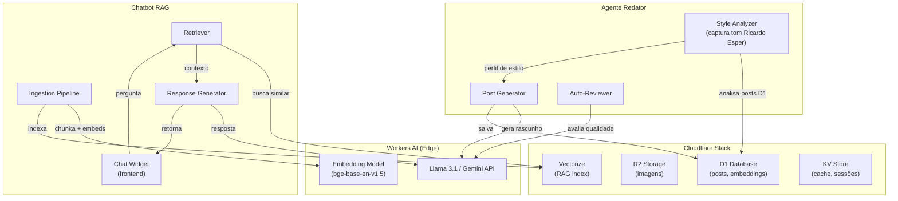

# PLAN: Agentes de IA — Redator Automático + Chatbot RAG

> Plano para criar dois agentes de IA integrados ao site esper.dev:
> 1. **Redator** — gera posts automáticos no estilo Ricardo Esper
> 2. **Chatbot** — widget público que responde com RAG dos posts existentes

---

## Visão Geral da Arquitetura



---

## Contexto & Decisões

| Decisão | Escolha | Justificativa |
|---------|---------|---------------|
| LLM principal | **Llama 3.1 (Workers AI)** + **Gemini API (fallback)** | Llama roda na edge sem custo extra; Gemini para tarefas complexas |
| Embedding model | **bge-base-en-v1.5** (Workers AI) | Gratuito na edge, bom para pt-BR/en |
| Vector store | **Cloudflare Vectorize** | Nativo do ecossistema, zero infra extra |
| Armazenamento | **D1** (posts e metadados) | Já migrado na fase anterior |
| Idiomas | **pt-BR** (primário) + **en** | Detecção automática, geração bilíngue |
| Estilo capturado | Posts anteriores do Ricardo Esper | Few-shot + system prompt extraído |
| Personalidade | **Alegre, espirituoso, levemente sarcástico, inteligente, inovador** | Traços-chave definidos pelo autor |

---

## Fase 1: Style Analyzer — Captura do Estilo

**Objetivo**: Analisar os posts existentes e extrair um perfil de estilo.

### Traços de Personalidade (definidos pelo autor)

| Traço | Descrição | Como se manifesta no texto |
|-------|-----------|----------------------------|
| 🎉 **Alegre** | Tom positivo e energético | Abertura envolvente, entusiasmo genuíno pelo tema |
| ✨ **Espirituoso** | Humor inteligente, jogo de palavras | Trocadilhos, metáforas inesperadas, títulos criativos |
| 😏 **Levemente sarcástico** | Ironia sutil, nunca ofensiva | Comentários entre parênteses, observações mordazes sobre hypes |
| 🧠 **Inteligente** | Profundidade técnica com clareza | Conceitos complexos explicados sem simplificar demais |
| 🚀 **Inovador** | Perspectivas frescas e não-óbvias | Conexões inesperadas entre temas, opiniões disruptivas |

> [!TIP]
> O tom **nunca** deve ser genérico/corporativo. Deve soar como um amigo técnico
> conversando num café — informal mas substancial.

### [NEW] `src/lib/agents/style-analyzer.ts`
- Lê os últimos 20-30 posts do D1
- Extrai padrões: tom, vocabulário, estrutura, tamanho médio
- Mapeia exemplos de cada traço de personalidade nos posts reais
- Gera um **system prompt** estilo "escreva como Ricardo Esper"
- Salva o perfil em D1/KV para reuso

### [NEW] `src/lib/agents/prompts/writer-persona.ts`
- System prompt template com o perfil extraído + os 5 traços acima
- Inclui regras: tamanho, formatação markdown, SEO keywords
- Exemplos few-shot extraídos dos posts (1 por traço)
- Variantes pt-BR e en

### Verificação
- [ ] Analisar 20+ posts e gerar perfil de estilo
- [ ] Validar que o perfil captura os 5 traços de personalidade
- [ ] Blind test: comparar post gerado vs original — tom deve ser indistinguível

---

## Fase 2: Agente Redator

**Objetivo**: Gerar posts completos automaticamente dado um tema.

### [NEW] `src/lib/agents/writer-agent.ts`
- Input: tema/keyword + idioma desejado
- Pipeline:
  1. **Research**: busca contexto via Workers AI (opcional: web search)
  2. **Outline**: gera estrutura do post
  3. **Draft**: escreve o post completo em markdown
  4. **Review**: auto-avalia qualidade, SEO, tom
  5. **Save**: salva como rascunho (`published: false`) no D1

### [NEW] `src/lib/agents/reviewer-agent.ts`
- Avalia o rascunho em 6 dimensões:
  - **Personalidade** (score 0-10): texto é alegre, espirituoso, levemente sarcástico?
  - **Fidelidade ao estilo** (score 0-10): soa como Ricardo Esper escreveria?
  - **Qualidade do conteúdo** (score 0-10): profundidade, precisão, valor
  - **SEO score** (0-10): keywords, headings, meta description
  - **Legibilidade** (0-10): fluência, parágrafos curtos, escaneabilidade
  - **Originalidade** (0-10): perspectiva única, não-genérica
- Se score médio < 7: reescreve seções fracas (foco nos scores baixos)
- Se score médio ≥ 7: marca como pronto para revisão humana
- Flag especial: rejeita se personalidade < 6 ("muito genérico/corporativo")

### [NEW] `src/pages/api/agents/generate-post.ts`
- API route para triggerar geração
- Params: `{ topic, language, autoPublish? }`
- Retorna o post gerado + scores do reviewer

### [MODIFY] Admin Dashboard
- Botão "Gerar Post com IA" no painel admin
- Lista de rascunhos gerados por IA
- Ação: aprovar / editar / rejeitar

### Verificação
- [ ] Gerar 3 posts de teste e comparar estilo com os originais
- [ ] Scores do reviewer > 7.0 em média
- [ ] Posts salvos corretamente no D1

---

## Fase 3: RAG Pipeline — Ingestão e Indexação

**Objetivo**: Indexar conteúdo para o chatbot responder com contexto.

### [NEW] `src/lib/agents/rag/ingestion.ts`
- Lê posts do D1
- Chunking inteligente (por seção/parágrafo, 500-800 tokens)
- Gera embeddings via Workers AI (`bge-base-en-v1.5`)
- Indexa no Cloudflare Vectorize
- Metadata: slug, título, categoria, data, idioma

### [NEW] `src/lib/agents/rag/retriever.ts`
- Query → embedding → busca top-K chunks similares
- Re-ranking por relevância
- Retorna contexto formatado para o LLM

### [NEW] `src/pages/api/agents/ingest.ts`
- API route para disparar ingestão manual
- Params: `{ slugs?: string[], all?: boolean }`
- Ingestão incremental (só posts novos/modificados)

### [NEW] Admin: Painel de Ingestão
- Botão "Indexar todos os posts"
- Botão "Indexar post específico"
- Status: quantos chunks indexados, última ingestão

### Verificação
- [ ] Todos os posts publicados indexados no Vectorize
- [ ] Busca semântica retorna chunks relevantes
- [ ] Re-ingestão incremental funciona

---

## Fase 4: Chatbot Widget

**Objetivo**: Widget de chat público no site que responde com RAG.

### [NEW] `src/components/ChatWidget.astro` + `ChatWidget.tsx`
- Widget flutuante (canto inferior direito)
- Design alinhado com o tema do site
- Animação de abertura/fechamento
- Input de texto + histórico de mensagens
- Indicador "digitando..."
- Responsivo (mobile-first)

### [NEW] `src/lib/agents/chatbot-agent.ts`
- Pipeline:
  1. Recebe pergunta do usuário
  2. Gera embedding da pergunta
  3. Busca top-5 chunks relevantes (retriever)
  4. Monta prompt com contexto RAG
  5. Gera resposta via Workers AI (Llama) ou Gemini API
  6. Streaming da resposta para o frontend

### [NEW] `src/pages/api/chat.ts`
- Endpoint streaming (SSE ou fetch stream)
- Rate limiting por IP
- Sanitização de input
- Logging de conversas (D1)

### [MODIFY] Layout principal
- Incluir `<ChatWidget />` no layout base
- Toggle via config (habilitar/desabilitar)

### Verificação
- [ ] Widget abre/fecha corretamente em mobile e desktop
- [ ] Respostas são baseadas no conteúdo real dos posts
- [ ] Streaming funciona sem travamentos
- [ ] Rate limiting previne abuso

---

## Fase 5: Infra & Config

### [NEW] `wrangler.toml` — adições
```toml
# Vectorize index
[[vectorize]]
binding = "VECTORIZE"
index_name = "esper-posts-index"
dimensions = 768
metric = "cosine"

# KV para cache
[[kv_namespaces]]
binding = "CACHE"
id = "xxx"

# AI binding
[ai]
binding = "AI"
```

### [MODIFY] `src/lib/cloudflare/env.d.ts`
- Adicionar tipos: `AI`, `VECTORIZE`, `CACHE` (KV)

### [NEW] `.env.example` — novas variáveis
```
GEMINI_API_KEY=           # Fallback LLM
WRITER_AUTO_PUBLISH=false # Auto-publicar posts gerados
CHAT_ENABLED=true         # Habilitar chatbot
CHAT_RATE_LIMIT=10        # Requests/min por IP
```

---

## Estimativa de Esforço

| Fase | Descrição | Esforço |
|------|-----------|---------|
| 1 | Style Analyzer | ~2h |
| 2 | Agente Redator | ~4h |
| 3 | RAG Pipeline | ~3h |
| 4 | Chatbot Widget | ~4h |
| 5 | Infra & Config | ~1h |
| **Total** | | **~14h** |

---

## Dependências

> [!IMPORTANT]
> Este plano depende da **migração Cloudflare estar completa** (D1 operacional, env types definidos).
> A Fase 5 pode ser feita em paralelo com a migração.

| Dependência | Status |
|-------------|--------|
| D1 schema + client | ✅ Feito |
| Posts module (D1) | ✅ Feito |
| Search module (FTS5) | ✅ Feito |
| Barrel export + consumer imports | ⏳ Pendente |
| Vectorize setup | 🆕 Novo |
| Workers AI binding | 🆕 Novo |

---

## Próximos Passos

1. ✅ Revisar este plano
2. ⏳ Terminar migração Cloudflare (Phase 4-5)
3. 🚀 Implementar agentes na ordem das fases acima
4. 🧪 Testar com posts reais
